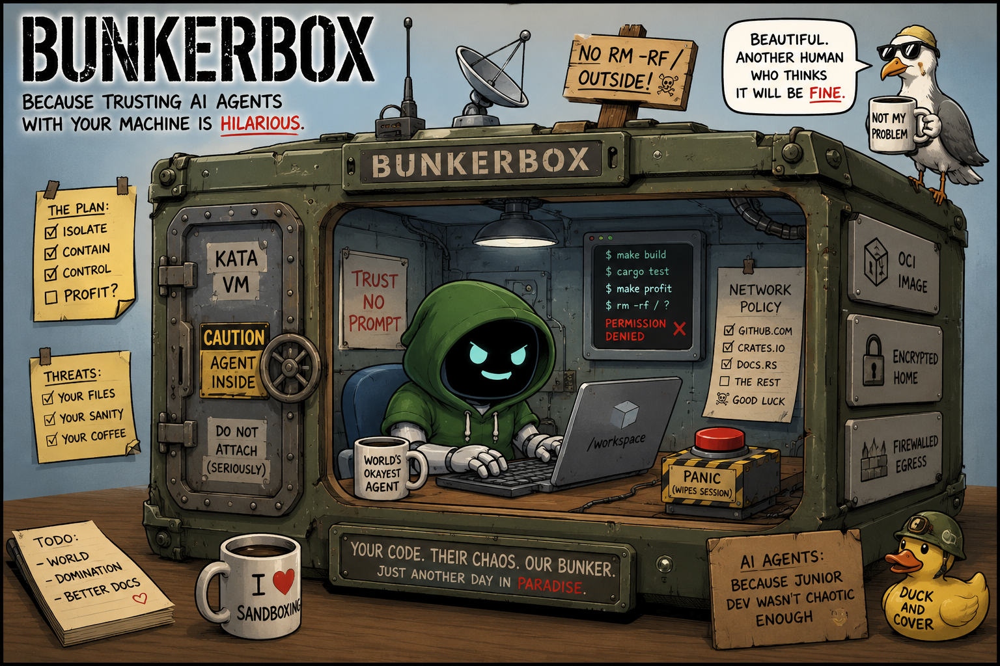

# Containers isolate processes.<br/>Bunkerbox isolates consequences.

<div align="center">
  
</div>

Bunkerbox gives AI coding agents a real development environment inside your
project. Not a sandboxed toy with crippled tooling. Not a remote VM you have
to babysit. Your actual toolchain, your actual files, your actual build
pipeline — running inside a boundary the agent cannot cross.

The agent edits code in a copy-on-write workspace. It runs `cargo build`,
`make test`, or `go vet` through your real compilers, wrapped in a bubblewrap
sandbox that sees only the binaries and directories you allowed. It reads
documentation, navigates the codebase, iterates on the project exactly as you
would — except every file it touches, every artifact it creates, every side
effect it produces lands in an overlay layer, not your repo. You review the
diff. You decide what stays.

Your credentials are encrypted at rest. Your network is firewalled. Your home
directory is invisible. The agent never sees your SSH keys, your API tokens,
or your shell history. It doesn't know your machine exists.

And when it's done — when the build passes, the tests are green, the feature
is written — one command syncs the changes into your working tree. Review,
commit, move on. The agent did the work. Bunkerbox kept the mess contained.

Bunkerbox isn't yet another sandbox. It's the difference between letting an
AI work on your project and letting it work on your machine.

---

## What it does

AI coding agents are powerful. They can edit code, run builds, and iterate on your
project. They can also `rm -rf` your home directory, exfiltrate your SSH keys, or
fill your disk with garbage — because they run as *you*.

Bunkerbox puts the agent inside a lightweight, immutable VM. From that sandbox:

- **Your repo** is an overlay copy-on-write workspace. The agent sees and edits
  files as usual, but your real repository stays untouched until you choose to
  sync changes back.
- **Your build tools** are available on-demand. A whitelist tells Bunkerbox which
  host commands to proxy into the VM via vsock. The agent runs `cargo build`,
  `make test`, or `go vet` using your real toolchain — inside the overlay, never
  on the host itself.
- **Your credentials** stay encrypted at rest. The VM gets a clean home directory.
  Sensitive files are sealed with AES-256-GCM between sessions.
- **Your network** is firewalled. Only destinations you explicitly allow are
  reachable from inside the container.
- **All changes auto-sync** when the agent exits. Your repo has the diff. You
  review, accept, commit.

## Documentation website

Build the documentation website with:

```sh
make docs
```

The static site is written to:

```text
target/site-docs/
```

## Where to go next

Start with the [Tutorial](guides/tutorial.md) to set up Bunkerbox and let an AI agent
work on a real project. Read [Concepts](concepts.md) to understand the model. Read
[Packaging](guides/packaging.md) to understand how a tool becomes a normal command.
